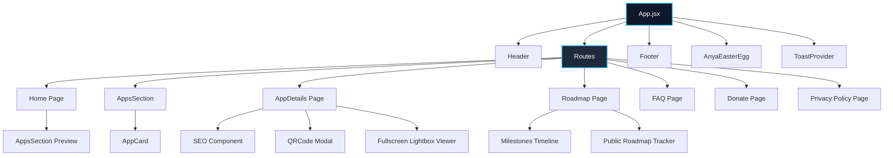

# 🚀 SKDev Web Portfolio

<div align="center">
  
</div>

<div align="center">
  
  
  
  
  
</div>

<br />

A modern, high-performance web portfolio for indie Android developer **Satya Kiran**. This web app serves as the centralized hub to showcase custom Android apps published on Google Play, share transparent developer journey milestones and public roadmap progress, provide interactive FAQs, offer direct purchase/donation options, and deliver a smooth, high-fidelity user experience.

---

## 📱 Featured Applications

| App | Type | Compatibility | Description | Links |
| :--- | :---: | :---: | :--- | :--- |
| **[Anify](https://anify.psatyakiran.in/)** | Free (Ads) | Android 7.0 – 16 (API 36) | Personalization & productivity suite: Ready-to-use widgets (No KWGT required), Sticker Studio (Telegram → WhatsApp), premium KWGT packs, BlockIt focus lock, HD wallpapers & ringtones. | [Play Store](https://play.google.com/store/apps/details?id=com.skdev.anify) • [Website](https://anify.psatyakiran.in/) |
| **[Aniset](https://aniset.psatyakiran.in)** | Paid | Android 5.0 – 16 | Anime KWGT & KLWP widget suite with iconic designs, curated anime wallpaper collection, and deep color & font customization. | [Play Store](https://play.google.com/store/apps/details?id=com.skdev.aniset) • [Website](https://aniset.psatyakiran.in) |
| **Gwalls** | Discontinued | Android | Curated collection of high-quality, ad-free wallpapers designed with privacy in mind. | *Discontinued* |

---

## ✨ Key Features

- **📱 App Showcase & Details:** Dedicated app detail pages featuring high-resolution WebP screenshots, interactive fullscreen lightbox zoom viewer, user reviews with developer replies, compatibility badges (Android 5.0 to 16 / API 36), and dynamic QR Codes.
- **🎨 Sticker Studio Integration:** Convert Telegram sticker sets to WhatsApp with 1-tap direct export in Anify.
- **⭐ Dynamic Ratings & Reviews Breakdown:** Interactive 5-to-1 star distribution bars, aggregate scores, and direct Google Play review action cards.
- **⚡ One-Click Direct Purchase Generator:** Instant pre-filled Telegram link generator for direct redeem code purchases (UPI ₹160 / PayPal $1.68) cutting out app store taxes.
- **🗺️ Developer Journey & Public Roadmap:** Interactive milestone timeline from 2023 to 2026+ and live public roadmap (`⚡ Active Development`, `👑 Next Phase`) with live progress bars and feature suggestion box.
- **🍞 Modern Glass Toast System:** Sleek, accessible toast notifications with auto-dismiss replacing browser alert popups.
- **🎨 100% Mobile Responsive Glassmorphic UI:** Sleek, modern dark-themed aesthetics with glassmorphism, fluid typography (`clamp()`), and subtle micro-animations that adapt seamlessly across small phones, foldables, tablets, and desktops.
- **❓ Interactive FAQ:** Filterable knowledge base with real-time text search and keyword highlighting.
- **💖 Support & Direct Donations:** Support options including UPI and PayPal payment details with QR codes and copy-friendly address fields.
- **🌐 Progressive Web App (PWA):** Fully installable on Android, iOS, Windows, and macOS with offline caching and service worker management.
- **⚡ Ultra-Optimized Asset Pipeline:** Next-gen **WebP** image pipeline reducing screenshot sizes by >92% for instant page loads.
- **🔍 SEO & Social Previews:** Automated OpenGraph meta tags, Twitter card summaries, and Schema.org structured JSON-LD data via `react-helmet-async`.
- **🥜 Anya Easter Egg:** Hidden interactive retro mode with audio cues and retro CRT screen effects.

---

## 🏗️ Architecture & Component Flow



---

## 📂 Project Structure

```text
skdev-web/
├── public/                  # Static public assets, icons & manifest
├── src/
│   ├── assets/              # Optimized WebP assets, logos & screenshots
│   │   ├── anify/           # Anify icon, backgrounds & screenshots (WebP)
│   │   └── gwalls/          # Gwalls assets
│   ├── components/          # Reusable UI components
│   │   ├── AnyaEasterEgg.jsx
│   │   ├── AppCard.jsx
│   │   ├── Footer.jsx
│   │   ├── Header.jsx
│   │   ├── OfficialInfographic.jsx
│   │   └── SEO.jsx
│   ├── context/             # Global application state & notifications
│   │   └── ToastContext.jsx
│   ├── data/                # Application & portfolio dataset
│   │   └── appsData.js
│   ├── pages/               # Route views & pages
│   │   ├── AppDetails.jsx
│   │   ├── AppsSection.jsx
│   │   ├── Donate.jsx
│   │   ├── FAQ.jsx
│   │   ├── Home.jsx
│   │   ├── PrivacyPolicy.jsx
│   │   ├── Roadmap.jsx
│   │   └── UnderDevelopment.jsx
│   ├── App.jsx              # Main App entry with routing & toast provider
│   ├── index.css            # Core design system, fluid tokens & animations
│   └── main.jsx             # React DOM root entry
├── package.json
├── vite.config.js           # Vite & PWA configuration
└── README.md
```

---

## 💻 Getting Started

### Prerequisites

- **Node.js** (v18.0.0 or higher recommended)
- **npm** or **yarn** / **pnpm**

### Installation

1. **Clone the repository:**
   ```bash
   git clone https://github.com/satyakiran29/skdev-web.git
   cd skdev-web
   ```

2. **Install dependencies:**
   ```bash
   npm install
   ```

3. **Start the local development server:**
   ```bash
   npm run dev
   ```
   Open `http://localhost:5173` in your browser.

---

## 🛠️ Build & Deployment

To generate an optimized production bundle:

```bash
npm run build
```

To preview the production build locally:

```bash
npm run preview
```

Lint code for style consistency:

```bash
npm run lint
```

---

## 📝 Adding or Modifying Apps

All application data is centrally declared in [`src/data/appsData.js`](file:///h:/Github/skdev-web/src/data/appsData.js). To add or update an app:

1. Place optimized WebP screenshots and icons in `src/assets/<app-name>/`.
2. Import the assets in `src/data/appsData.js`.
3. Add the application object with details, screenshots, download links, and reviews.
4. The portfolio dynamically renders the app cards, details page, QR code modal, and SEO metadata.

---

## 🧑‍💻 Maintainer & Community Contact

- **Developer:** Satya Kiran ([@satyakiran29](https://github.com/satyakiran29))
- **Google Play Developer Profile:** [SKDev](https://play.google.com/store/apps/dev?id=9166037782169864125)
- **Telegram Channel:** [@skdev29](https://t.me/skdev29)
- **Telegram Community Chat:** [@skdev_chat](https://t.me/skdev_chat)
- **Direct Support / Telegram:** [@skdev1](https://t.me/skdev1)
- **Email:** [satyakiran296@gmail.com](mailto:satyakiran296@gmail.com)

---

## 📄 License

This project is licensed under the [MIT License](LICENSE).
