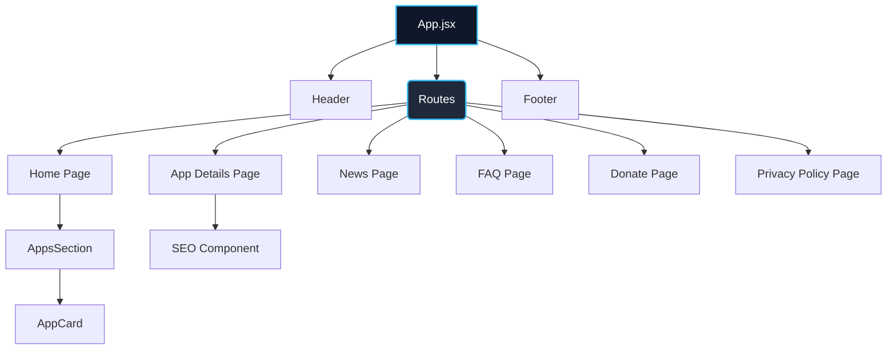

# 🚀 SKDev Web Portfolio

<div align="center">
  
</div>

<div align="center">
  
  
  
  
</div>

<br />

A modern, responsive web portfolio for indie developer Satya Kiran. This application serves as a centralized hub to showcase Android applications published on the Google Play Store, share news updates, provide FAQs, and offer a support/donation platform.

## 📊 Overview

<div align="center">
  
</div>

## ✨ Key Features

- **📱 App Showcase & Details:** Browse featured applications with dedicated detail pages including descriptions, screenshots, and direct download links to the Google Play Store.
- **🎨 Modern Responsive Design:** A sleek, glassmorphic UI that adapts perfectly to desktop, tablet, and mobile devices.
- **📰 News Integration:** Dedicated section for the latest updates on app releases and developer news.
- **🛡️ User Privacy & Support:** Built-in Privacy Policy, FAQ, and Support/Donation pages to ensure transparency and user trust.
- **⚡ High Performance:** Built with Vite and React 19 for instantaneous hot-module replacement and optimized production builds.

## 🏗️ Architecture & Component Flow



## 📂 Project Structure

```mermaid
mindmap
  root((src/))
    assets/
      ::icon(fas fa-image) Images and SVGs
    components/
      ::icon(fas fa-cube) Reusable UI logic
      AppCard.jsx
      Header.jsx
      Footer.jsx
      SEO.jsx
    pages/
      ::icon(fas fa-file) Route Views
      Home.jsx
      AppDetails.jsx
      News.jsx
      FAQ.jsx
    data/
      ::icon(fas fa-database) Static JSON/JS Data
      appsData.js
```

## 💻 Getting Started

Follow these steps to set up the project locally for development or testing:

### Prerequisites

You need to have **Node.js** (v18+ recommended) and **npm** installed on your machine.

### Installation

1. **Clone the repository:**
   ```bash
   git clone https://github.com/satyakiran29/skdev-web.git
   cd skdev-web
   ```

2. **Install dependencies:**
   ```bash
   npm install
   ```

3. **Start the development server:**
   ```bash
   npm run dev
   ```
   The application will be available at `http://localhost:5173`.

### Build & Preview Production

To build the application for production deployment:

```bash
npm run build
```

To preview the built production bundle locally:

```bash
npm run preview
```

## 📝 Usage Example: Adding a New App

To add a new application to the portfolio, update the applications data file (usually located in `src/data/appsData.js`). You don't need to create new UI components; the app will automatically render in the featured list and create a detail page route.

## 🤝 Support and Help

If you encounter any issues while using the application or running it locally, you can:
- **Email:** Reach out to the developer directly at [satyakiran296@gmail.com](mailto:satyakiran296@gmail.com).
- **Issues:** Submit a bug report or feature request in the GitHub [Issues](../../issues) tab of this repository.

## 🧑‍💻 Maintainers & Contributions

**Maintainer:** [Satya Kiran](https://play.google.com/store/apps/dev?id=9166037782169864125) (Indie Developer)

### Contributing

Contributions are welcome! If you'd like to improve the site's layout, fix a bug, or add a new component, please follow these steps:

1. Fork the repository.
2. Create a new branch (`git checkout -b feature/awesome-feature`).
3. Commit your changes (`git commit -m 'Add an awesome feature'`).
4. Push to the branch (`git push origin feature/awesome-feature`).
5. Open a Pull Request.

Please ensure your code follows the existing ESLint configuration (`npm run lint`).
